<div align="center">

# RAKKUNN

**System Security Researcher**

`TEE` · `System Security` · `Trusted Computing`

Exploring the boundaries of trusted execution and system-level security.

</div>

<br>

<!-- ============================================================ -->
<!--                      BENTO GRID START                        -->
<!-- ============================================================ -->

<table>
<tr>

<!-- ─── LEFT: Metrics Overview ─── -->
<td width="50%" valign="top">

<h3 align="center">📊 Overview</h3>
<p align="center">
  
</p>

</td>

<!-- ─── RIGHT: Languages ─── -->
<td width="50%" valign="top">

<h3 align="center">⚙️ Languages</h3>
<p align="center">
  
</p>

</td>

</tr>
<tr>

<!-- ─── LEFT: Contribution Calendar ─── -->
<td width="50%" valign="top">

<h3 align="center">📅 Contributions</h3>
<p align="center">
  
</p>

</td>

<!-- ─── RIGHT: Coding Habits ─── -->
<td width="50%" valign="top">

<h3 align="center">🕐 Coding Habits</h3>
<p align="center">
  
</p>

</td>

</tr>
<tr>

<!-- ─── LEFT: Research Interests ─── -->
<td width="50%" valign="top">

<h3 align="center">🔬 Research Interests</h3>

&nbsp;

**Trusted Execution Environments**
<br>ARM TrustZone · Intel SGX · Confidential Computing

**System Security**
<br>Kernel hardening · Secure boot · Firmware analysis

**Low-level Security**
<br>Memory safety · Binary analysis · Exploit mitigation

&nbsp;

</td>

<!-- ─── RIGHT: Tech Stack ─── -->
<td width="50%" valign="top">

<h3 align="center">🛠 Tech Stack</h3>

&nbsp;

```text
Languages      C · Python · Assembly
Environments   Linux · Embedded Systems
Security       GDB · QEMU · IDA · Ghidra
VCS            Git · GitHub · GitLab
Editor         VSCode · Vim
```

&nbsp;

</td>

</tr>
<tr>

<!-- ─── FULL WIDTH: Contact ─── -->
<td colspan="2" align="center">

<br>

[](mailto:woojinim64@gmail.com)&nbsp;&nbsp;
[](https://dev.to/rakkunn)&nbsp;&nbsp;
[](https://velog.io/@rakkunn/posts)

<sub>📌 Open to collaboration on system security research</sub>

<br>

</td>

</tr>
</table>
